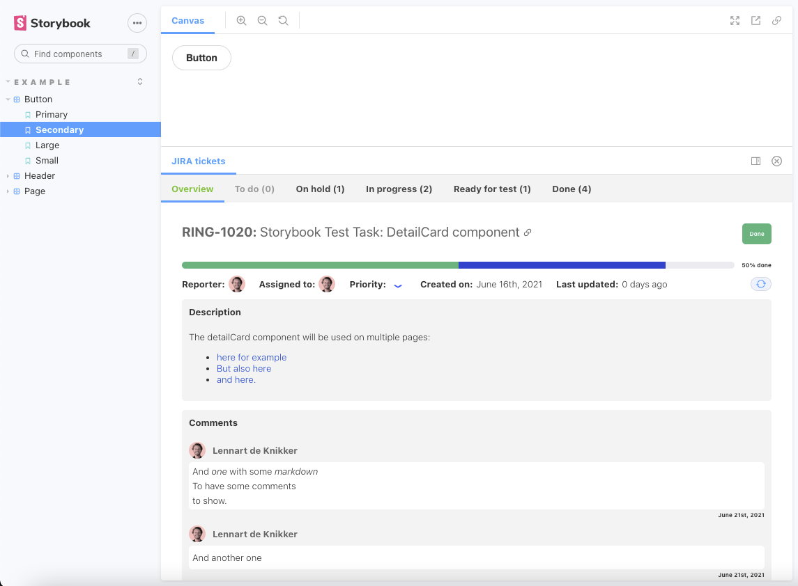

# JIRA addon for Storybook

This addon makes JIRA ticket information visible and linked within your stories. 



## Usage
Just add the ticket ID as a parameter to your component story like this:

```js
export default {
  title: "Example/Button",
  component: Button,
  parameters: {
    jira: {
      id: 'RING-1020'
    }
  },
};
```

## Installation
1.  To add this addon to your storybook configuration, first run `yarn add storybook-jira-addon`.
2.  Then add it to the `addons` array in `main.js`:
    ```js
    addons: [
      "storybook-jira-addon"
    ],
    ```
2.  You will need to add the following values to your `.env` file.:
    <details>
    <summary>`STORYBOOK_JIRA_API_ENDPOINT`</summary> 
    This will be the API endpoint for obtaining ticket data from JIRA. This will be something like: `https://<company-name>.atlassian.net/rest/api/latest/issue`
    </details>
    <details>
    <summary>`STORYBOOK_JIRA_USERNAME`</summary>
    This will be your username for logging in to JIRA. Most of the times it will just be your email address.
    </details>
    <details>
    <summary>`STORYBOOK_JIRA_API_KEY`</summary>
    To use this addon, you will need to generate an API token for your JIRA account. This can be acquired [here](https://id.atlassian.com/manage-profile/security/api-tokens).
    </details>
    <details>
    <summary>`STORYBOOK_JIRA_BASE_URL`</summary>
    This will be something like: `https://<company-name>.atlassian.net/browse`.
    </details>


3.  Within storybook you then need to run some middleware to set up the api. To do this, add a `middleware.js` file in your `.storybook` folder. To use basic authentication this file then needs to contain the following code:

    ```js
    const fetch = require("node-fetch");

    module.exports = function expressMiddleware (router) {
      router.get('/api', (req, res) => {

          const myHeaders = new fetch.Headers();
          const authHeader = `Basic ${Buffer.from(`${process.env?.STORYBOOK_JIRA_USERNAME}:${process.env?.STORYBOOK_JIRA_API_KEY}`).toString('base64')}`
          myHeaders.append("Authorization", authHeader);

          const requestOptions = {
            method: 'GET',
            headers: myHeaders,
            redirect: 'follow'
          };

          fetch(`${process.env.STORYBOOK_JIRA_API_ENDPOINT}/${req.query?.ticketId}`, requestOptions)
            .then(response => response.json())
            .then(result => {
              res.send(result)
            })
            .catch(error => console.log('error', error));
      })
    }
    ```
    *Alternatively you can set up authentication using OAuth as is described [here](https://developer.atlassian.com/cloud/jira/platform/rest/v3/intro/#authentication).*

    You might need to still add `node-fetch` to your dev dependencies by running `yarn add node-fetch -D`.

## Deploying to netlify
When deploying to netlify, you can get the addon working by adding a serverless function.

To do this I recommend taking the steps below:
1. Create a new file called `netlify/functions/get-ticket-data.js`

    *Creating this file in a different folder is possible, but requires additional configuration in the Netlify UI.*

2. add the code below to `get-ticket-data.js`:
```js
const fetch = require('node-fetch');

exports.handler = async function (event, context) {
  
  const myHeaders = new fetch.Headers();
  const authHeader = `Basic ${Buffer.from(`${process.env.STORYBOOK_JIRA_USERNAME}:${process.env.STORYBOOK_JIRA_API_KEY}`).toString('base64')}`
  myHeaders.append("Authorization", authHeader);

  const requestOptions = {
    method: 'GET',
    headers: myHeaders,
    redirect: 'follow'
  };

  const ticketData = await fetch(`${process.env.STORYBOOK_JIRA_API_ENDPOINT}/${event.queryStringParameters.ticketId}`, requestOptions)
  .then(response => response.text())
  .then(result => {
    return result
  })
  .catch(error => console.log('error', error));
  
  return {
    statusCode: 200,
    body: JSON.stringify(ticketData)
  }
}
```
3. Add the same environment variables to Netlify as well as this new one for the created endpoint:
    <details>
    <summary>`STORYBOOK_MIDDLEWARE_JIRA_ENDPOINT`</summary> 
    In this case this will be: `/.netlify/functions/get-ticket-data`
    </details>


*[Read more about setting up serverless functions in Netlify here.](https://docs.netlify.com/functions/overview/)*

## Additional configuration

To make tabs for certain subticket statusses persistent and have them show up even if no subticket has that status, you can define status options within `.storybook/preview.js` as shown below. This array will also define the order in which statusses are shown in the progress bar.

```js
export const parameters = {
  jira: { persistentTabs: [
    'To do', 'In progress', 'Done'
  ] }
}
```